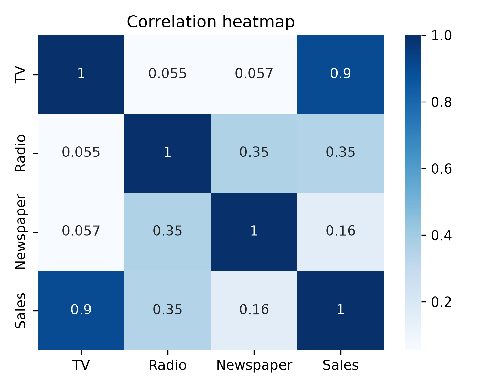
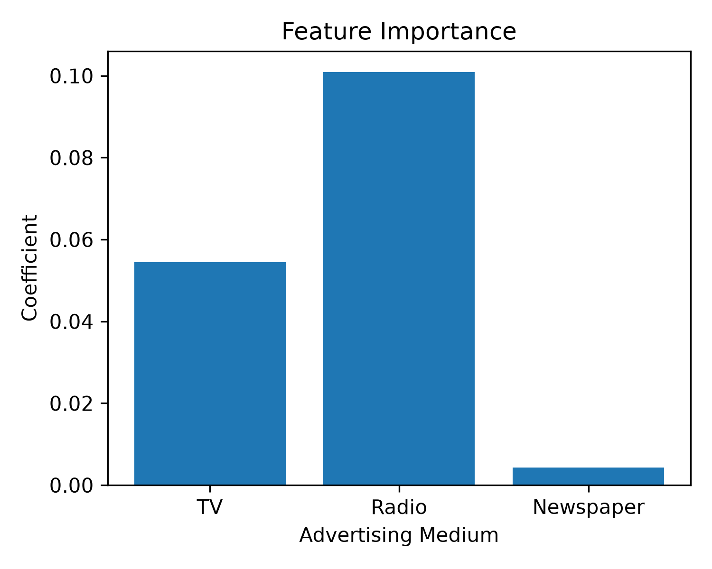
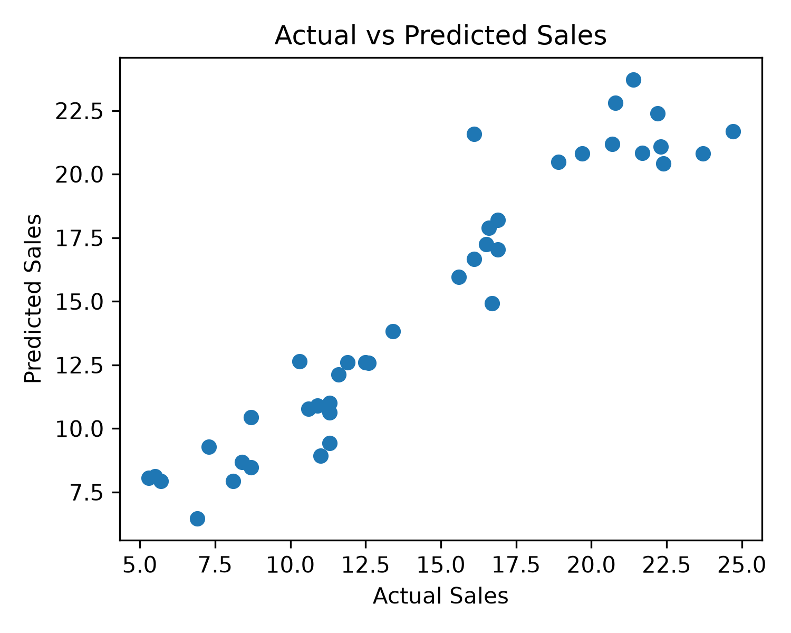

# Sales-Prediction-ML
Sales Prediction using Machine Learning and Linear Regression
# 📊 Sales Prediction using Machine Learning
## Overview
This project predicts product sales based on advertising expenditure across TV, Radio, and Newspaper platforms using Linear Regression.

The goal is to analyze the impact of different advertising channels and predict future sales using Machine Learning.

## Technologies Used
- Python
- Pandas
- Matplotlib
- Seaborn
- Scikit-learn

## Project Workflow

1. Data Loading and Exploration
2. Correlation Analysis using Heatmap
3. Feature Selection
4. Train-Test Split
5. Linear Regression Model Training
6. Sales Prediction
7. Model Evaluation using R² Score and MAE
8. Visualization of Results
9. Custom Sales Prediction

## Model Performance
- R² Score: **0.9059**
- Linear Regression Model

## Visualizations

### Correlation Heatmap

### Feature Importance

### Actual vs Predicted Sales

## Key Insights

- Radio advertising showed the strongest influence on sales.
- TV advertising also had a significant impact.
- Newspaper advertising contributed the least to sales prediction.

## Author

**Sruthi Kannan**

3rd Year CSE (AI & DS)

SASTRA University
